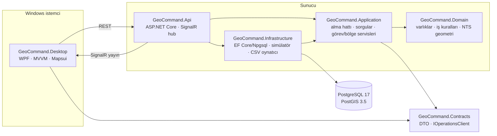

# GeoCommand

Windows üzerinde çalışan, harita tabanlı bir **görev ve olay takip simülasyonu**. Operatör simüle araçların anlık konumlarını haritada izler, operatörün çizdiği bölgelere giriş/çıkış olaylarını takip eder, araçlara görev atar ve seçili aracın belirli bir tarih aralığındaki konum geçmişini ve olaylarını sorgular.

> **Kapsam:** Bu bir eğitim/portföy simülasyonudur. Hiçbir gerçek sisteme, cihaza veya kurumsal veriye bağlanmaz. "Görev atama" yalnızca simülasyon veritabanındaki bir kaydı değiştirir.


| Konum geçmişi ve iz | Haritada bölge çizimi |
|---|---|
|  |  |
| **Bağlantı koptu** | **Yeniden bağlandı ve eşitlendi** |
|  |  |

Ekran görüntüleri çalışan uygulamadan `tools/capture-window.ps1` ile alındı.

---

## İçindekiler

- [Özellikler](#özellikler)
- [Mimari](#mimari)
- [Teknoloji seçimleri](#teknoloji-seçimleri)
- [Kurulum ve çalıştırma](#kurulum-ve-çalıştırma)
- [Demo senaryosu](#demo-senaryosu-yaklaşık-3-dakika)
- [Yapılandırma](#yapılandırma)
- [Veri kaynakları ve dosya biçimleri](#veri-kaynakları-ve-dosya-biçimleri)
- [REST API ve SignalR](#rest-api-ve-signalr)
- [Testler](#testler)
- [Tasarım kararları](#tasarım-kararları)
- [Bilinen sınırlamalar](#bilinen-sınırlamalar)

## Özellikler

| # | Özellik | Nerede |
|---|---|---|
| 1 | 4 simüle araç (ALFA-1, BRAVO-2, CHARLIE-3, DELTA-4): kimlik, çağrı adı, durum, son konum, son güncelleme zamanı | `Domain/Vehicles`, migration seed |
| 2 | Ayrı arka plan hizmeti olarak simülatör; seed'e bağlı **tekrar üretilebilir** JSON senaryoları; API/istemciden başlat/durdur | `Infrastructure/DataSources/Simulation`, `Api/Hosting/PositionSourceRunner` |
| 3 | Konum bildirimleri doğrulanır, PostGIS'e kaydedilir, SignalR ile yayınlanır; harici kaynaklar için `POST /api/positions` | `Application/Ingestion` |
| 4 | WPF ekranı: araç listesi, seçili araç ayrıntıları, harita (OSM altlık), canlı olay listesi, bağlantı durumu | `Desktop` |
| 5 | Haritaya tıklayarak çokgen bölge çizme; giriş/çıkışta olay. Hesaplar WGS84 (`geometry(Polygon,4326)`) üzerinde yapılır, ekran pikseliyle değil | `Domain/Zones`, `Desktop/Views/MapView` |
| 6 | Araca görev atama: açıklama, öncelik, durum, atanma zamanı; durum geçiş kuralları; araç başına tek aktif görev | `Domain/Missions` |
| 7 | Seçili araç için tarih aralığında konum geçmişi (izi haritada gösterir, mesafe hesaplar) ve olaylar | `Application/Queries` |
| 8 | Aynı `IPositionSource` arayüzünü uygulayan iki kaynak: **simülatör** ve **CSV kayıt dosyası**; `DataSource:Type` ile seçilir | `Infrastructure/DataSources` |
| 9 | Bağlantı kopunca uyarı bandı ve durum göstergesi; otomatik yeniden bağlanma; yeniden bağlanınca REST'ten eşitleme; yinelenen olay önleme | `Desktop/Services/LiveConnection`, `Desktop/ViewModels/OperationsState` |
| 10 | Girdi doğrulama (Türkçe ProblemDetails), yapılandırma doğrulama, Serilog ile yapılandırılmış JSON log, repoda parola yok | `Api/Hosting/ApiExceptionHandler`, `.env.example` |

Ek olarak: 15 sn bildirim göndermeyen araç **çevrimdışı** işaretlenir ve olay üretilir; bildirim yeniden gelince **yeniden çevrimiçi** olayı üretilir.

## Mimari



**Bağımlılık yönü:** `Domain` hiçbir projeye bağımlı değildir (yalnızca NetTopologySuite geometri kütüphanesi). `Application`, `Domain` ve `Contracts`'a bağımlıdır; veritabanına kendi tanımladığı `IGeoCommandDbContext` üzerinden erişir. `Infrastructure` bu arayüzü EF Core ile uygular. `Desktop` sunucu projelerinin hiçbirini görmez, yalnızca `Contracts`'ı kullanır.

Soyutlamalar yalnızca gerçek bir ihtiyaç olduğunda eklendi:
- `IGeoCommandDbContext`: Application'ın Infrastructure'a bağımlı olmaması için.
- `IPositionSource`: iki gerçek uygulaması var (simülatör, dosya).
- `IOperationsClient`: SignalR hub'ının tipli arayüzü. Application yayınları bunun üzerinden yapar, Api bunu `IHubContext` ile bağlar. Böylece ayrı bir "notifier" katmanı gerekmez.

Repository katmanı bilerek eklenmedi; EF Core `DbSet` zaten bu görevi görüyor.

### Bir konum bildiriminin yolu

```mermaid
sequenceDiagram
    participant S as Simülatör / CSV / HTTP
    participant P as PositionIngestionService
    participant DB as PostGIS
    participant H as SignalR hub
    participant W as WPF istemci

    S->>P: PositionReport (çağrı adı, enlem, boylam, hız, yön, zaman)
    P->>P: Doğrula (aralıklar, gelecek zaman, bilinen araç)
    P->>P: Araç kilidi al; bildirim son kayıttan yeni mi? (değilse Duplicate)
    P->>DB: Konum geçmişi + araç son durumu
    P->>P: GeofenceEvaluator: önceki üyelik ↔ yeni konum
    P->>DB: Üyelik satırları + ZoneEntered/ZoneExited olayları (tek işlem)
    P->>H: VehicleUpdated, EventRaised
    H-->>W: canlı güncelleme
```

## Teknoloji seçimleri

| Alan | Seçim | Gerekçe |
|---|---|---|
| Çalışma zamanı | **.NET 10 (LTS)**, SDK 10.0.401 (`global.json`) | Makinede .NET 8 kuruluydu ancak .NET 8'in desteği 10 Kasım 2026'da bitiyor. .NET 10, Kasım 2028'e kadar desteklenen güncel LTS sürümü olduğu için kuruldu. `rollForward: latestFeature` ile 10.0.x yamalarıyla derlenir. |
| Masaüstü | WPF + XAML + MVVM ([CommunityToolkit.Mvvm](https://github.com/CommunityToolkit/dotnet), MIT) | Kaynak üreticileri `INotifyPropertyChanged` ve komut tekrarını ortadan kaldırır. |
| Harita | [Mapsui 5.1](https://github.com/Mapsui/Mapsui) (MIT) + OpenStreetMap karoları | Lisansı ticari/kapalı kullanım dahil serbest; WPF kontrolü var; NTS geometrilerini doğrudan çizer. Altlık veri © OpenStreetMap katkıda bulunanlar (ODbL). Harita üzerinde atıf gösterilir ve OSM karo politikasının istediği tanımlayıcı `User-Agent` gönderilir. Bu kullanım **tanıtım amaçlıdır**; yoğun veya üretim kullanımı için kendi karo sunucunuz ya da ticari bir sağlayıcı gerekir. `Map:UseOnlineTiles=false` ile internet olmadan yalnızca vektör katmanlar çizilir. |
| Sunucu | ASP.NET Core Minimal API | Uç nokta sayısı az; controller katmanı gereksiz. |
| Canlı veri | SignalR (WebSocket), tipli hub `Hub<IOperationsClient>` | Sunucudan istemciye itme. İstemcide otomatik yeniden bağlanma var. |
| Veritabanı | PostgreSQL 17 + PostGIS 3.5, EF Core 10, Npgsql + NetTopologySuite | Koordinatlar `geometry(Point/Polygon, 4326)` sütunlarında tutulur ve GIST ile indekslenir. "Bölgedeki araçlar" sorgusu PostGIS'te `ST_Covers` ile çalışır. |
| Log | Serilog: konsol ve günlük dönen sıkıştırılmış JSON dosyası | Mesaj şablonları yapılandırılmış alanlar (`Çağrı`, `Bölge`, `Olay`…) olarak saklanır. |
| Test | xUnit, Testcontainers (gerçek PostGIS konteyneri), WebApplicationFactory, SignalR .NET istemcisi | Entegrasyon testleri bellek içi sahte veritabanı değil, gerçek PostGIS kullanır. |

## Kurulum ve çalıştırma

### Gereksinimler

| Araç | Not |
|---|---|
| Windows 10 (2004 / 19041) veya üzeri | **WPF istemci yalnızca Windows'ta çalışır.** API ve testler .NET'in çalıştığı her platformda çalışır; ancak Desktop ve Desktop.Tests projeleri Windows hedeflidir, bu yüzden `dotnet build GeoCommand.slnx` Windows dışında başarısız olur. |
| .NET SDK 10.0.x | `winget install Microsoft.DotNet.SDK.10` |
| Docker Desktop | Veritabanı ve entegrasyon testleri için |

### 1. Veritabanı

```powershell
Copy-Item .env.example .env        # sonra .env içindeki GEOCOMMAND_DB_PASSWORD değerini değiştirin
docker compose up -d               # PostGIS, localhost:5433
```

Varsayılan port **5433**'tür, çünkü makinede yerel bir PostgreSQL 5432'yi kullanıyor olabilir. `.env` git tarafından yok sayılır.

### 2. API bağlantı dizesi (repoya girmez)

```powershell
$pw = (Select-String -Path .env -Pattern '^GEOCOMMAND_DB_PASSWORD=(.*)$').Matches[0].Groups[1].Value
dotnet user-secrets set "ConnectionStrings:GeoCommand" "Host=localhost;Port=5433;Database=geocommand;Username=geocommand;Password=$pw" --project src/GeoCommand.Api
```

Alternatif olarak `ConnectionStrings__GeoCommand` ortam değişkeni de kullanılabilir. Bağlantı dizesi yoksa API, bu adımı işaret eden bir hata mesajıyla başlamaz.

### 3. API

```powershell
dotnet run --project src/GeoCommand.Api
```

- `http://localhost:5080` adresinde açılır. Migration'lar otomatik uygulanır (`Database:MigrateOnStartup`) ve simülatör `ankara-devriye` senaryosuyla kendiliğinden başlar.
- Sağlık kontrolü: `http://localhost:5080/health`, OpenAPI belgesi (Development): `http://localhost:5080/openapi/v1.json`

### 4. WPF istemci (ayrı terminal)

```powershell
dotnet run --project src/GeoCommand.Desktop
```

İstemci loglarını `%LOCALAPPDATA%\GeoCommand\logs\` altına yazar. API adresi `src/GeoCommand.Desktop/appsettings.json` içindeki `Api:BaseUrl` ayarından veya `GEOCOMMAND_Api__BaseUrl` ortam değişkeninden gelir.

### Kapatma / sıfırlama

```powershell
docker compose down        # veriyi korur
docker compose down -v     # veritabanı birimini de siler
```

## Demo senaryosu (yaklaşık 3 dakika)

1. **Canlı izleme.** API ve istemciyi başlatın. Dört araç Ankara merkezde hareket eder. Sol listede durumları, sağ üstte yeşil **● Canlı** göstergesi görünür.
2. **Bölge ve olay.** Harita üzerindeki **＋ Yeni bölge çiz** düğmesine basın, Sıhhiye kavşağı çevresine 4 kez tıklayın, ad verip **Kaydet**'e basın. ALFA-1 ve BRAVO-2 rotaları buradan geçer; birkaç saniye içinde olay listesine yeşil "Bölgeye giriş" ve turuncu "Bölgeden çıkış" satırları düşer.
3. **Görev atama.** ALFA-1'i listeden veya haritadan seçin. *Görevler* sekmesinde açıklama ve öncelik girip **Görev ata**'ya basın. Araç mavi **Görevde** durumuna geçer. **Başlat** ve **Tamamla** ile durum geçişlerini gösterin. İkinci görev atanmaya çalışılırsa API anlaşılır bir 409 mesajı döner.
4. **Geçmiş sorgusu.** *Geçmiş* sekmesinde **Son 5 dk**'ya basın. İz haritada mor çizgiyle, özet satırında konum sayısı, katedilen mesafe ve olaylar görünür.
5. **Bağlantı kopması.** API'nin terminalinde `Ctrl+C` ile API'yi durdurun. İstemcide kırmızı bant ve **Yeniden bağlanıyor** göstergesi çıkar. API'yi tekrar başlatın. İstemci kendiliğinden bağlanır, durumu REST'ten çeker ve mavi bantta "bağlantı kopukken N yeni olay" bilgisini gösterir. Olaylar tekrarlanmaz.
6. **Kaynak değiştirme.** Üst çubuktan `kizilay-gecis` senaryosunu seçip **Başlat**'a basın. DELTA-4 bu senaryoda olmadığı için 15 sn sonra "Çevrimdışı" olayı üretilir. **Durdur** ile tüm araçların çevrimdışına düştüğünü gösterin.
7. *(İsteğe bağlı)* Dosya kaynağı: `$env:DataSource__Type="File"; dotnet run --project src/GeoCommand.Api` ile API, simülatör yerine `data/replay/ankara-kayit.csv` kaydını oynatır.

## Yapılandırma

`src/GeoCommand.Api/appsettings.json` (parola içermez):

| Anahtar | Varsayılan | Açıklama |
|---|---|---|
| `ConnectionStrings:GeoCommand` | *(yok)* | user-secrets veya ortam değişkeni ile verilir |
| `Database:MigrateOnStartup` | `true` | Açılışta migration uygula |
| `DataSource:Type` | `Simulator` | `Simulator` veya `File` |
| `DataSource:AutoStart` | `true` | Kaynağı API açılışında başlat |
| `DataSource:Simulator:ScenarioDirectory` / `DefaultScenario` | `data/scenarios` / `ankara-devriye` | |
| `DataSource:File:Directory` / `DefaultFile` | `data/replay` / `ankara-kayit.csv` | |
| `DataSource:File:PlaybackSpeed` | `1.0` | 2 = iki kat hızlı |
| `DataSource:File:Loop` | `true` | Dosya bitince baştan oynat |
| `Liveness:OfflineAfterSeconds` | `15` | Bu süre bildirim yoksa araç çevrimdışı |
| `Liveness:CheckIntervalSeconds` | `5` | Kontrol aralığı |
| `Serilog:*` | konsol + `logs/geocommand-api-*.json` | |

Geçersiz yapılandırma (ör. `DataSource:Type=Foo`) API açılışında anlamlı bir mesajla yakalanır (`ValidateOnStart`).

## Veri kaynakları ve dosya biçimleri

Her iki kaynak da `IPositionSource` arayüzünü uygular ve bildirimlerini HTTP ile gelenlerle **aynı** doğrulama ve olay hattından geçirir. Senaryo veya dosya adı yalnızca ilgili klasördeki listeden seçilebilir; istemci keyfi bir dosya yolu gönderemez.

### Simülatör senaryosu: `data/scenarios/*.json`

```jsonc
{
  "name": "ankara-devriye",
  "seed": 4242,          // aynı seed → aynı konum dizisi (birim testiyle doğrulanır)
  "tickSeconds": 1.0,
  "vehicles": [
    {
      "callsign": "ALFA-1",
      "speedMps": 18,
      "speedJitter": 0.15,   // her adımda hız ±%15 (seed'e bağlı)
      "dwellSeconds": 0,     // rota noktalarında bekleme (hız 0 → "Beklemede")
      "loop": true,
      "route": [[39.9208, 32.8541], [39.9300, 32.8580], [39.9265, 32.8660]]  // [enlem, boylam]
    }
  ]
}
```

Hazır senaryolar: `ankara-devriye` (4 araç döngüsel devriye) ve `kizilay-gecis` (Kızılay'ı sürekli kesen kısa rotalar; bölge olaylarını hızlı göstermek için).

### Kayıt dosyası: `data/replay/*.csv`

```text
# '#' ile başlayan satırlar yorumdur. UTF-8, ondalık ayırıcı nokta (işletim sistemi dilinden bağımsız).
offset_seconds,callsign,latitude,longitude,speed_mps,heading_deg
0.0,ALFA-1,39.9060000,32.8600000,12.93,152.9
2.0,ALFA-1,39.9057597,32.8601602,15.01,152.9
```

`offset_seconds`, oynatma başlangıcına göre saniyedir ve azalmamalıdır. Zaman damgaları oynatma anına göre yeniden hesaplanır. Hatalı satırlar satır numarasıyla raporlanır ve dosya reddedilir. Örnek dosya (`ankara-kayit.csv`, 3 araç, 5 dakika) `tools/generate_replay.py` ile sabit seed'le üretildi.

## REST API ve SignalR

| Yöntem | Yol | Açıklama |
|---|---|---|
| GET | `/api/vehicles` | Tüm araçların güncel durumu (istemci yeniden bağlanınca bunu çağırır) |
| GET | `/api/vehicles/{id}` | Tek araç |
| GET | `/api/vehicles/{id}/positions?from=&to=&limit=` | Tarih aralığında konum geçmişi (en fazla 31 gün, varsayılan 5000 nokta; `truncated` bayrağı ve toplam mesafe) |
| GET | `/api/vehicles/{id}/missions` | Aracın görevleri |
| POST | `/api/vehicles/{id}/missions` | Görev ata `{ "description", "priority": "Low/Normal/High/Critical" }` → 201 |
| PUT | `/api/missions/{id}/status` | `{ "status": "InProgress/Completed/Cancelled" }` |
| GET | `/api/events?vehicleId=&from=&to=&limit=` | Olaylar (yeniden eskiye) |
| GET / POST | `/api/zones` | Bölgeleri listele / oluştur `{ "name", "vertices": [{ "latitude", "longitude" }] }` |
| DELETE | `/api/zones/{id}` | Bölgeyi sil (geçmiş olaylar korunur) |
| GET | `/api/zones/{id}/vehicles` | Son konumu bölgede olan araçlar (PostGIS `ST_Covers`) |
| POST | `/api/positions` | Harici konum bildirimi → 202 / 400 / 404 / 409 (`Duplicate`) |
| GET | `/api/source` · POST `/api/source/start` · POST `/api/source/stop` | Veri kaynağı durumu / başlat `{ "scenario" }` / durdur |
| GET | `/health` | Veritabanı dahil sağlık kontrolü |

Hatalar `application/problem+json` biçiminde ve Türkçe döner:

```json
{ "title": "Girdi doğrulanamadı.", "status": 400,
  "detail": "Enlem -90 ile 90 arasında olmalı (gelen: 99). Zaman damgası gelecekte olamaz (...).",
  "errors": ["Enlem -90 ile 90 arasında olmalı (gelen: 99).", "..."] }
```

**SignalR hub:** `/hubs/operations`. Sunucudan istemciye giden mesajlar `VehicleUpdated`, `EventRaised`, `MissionChanged`, `ZoneCreated`, `ZoneDeleted` ve `SourceStatusChanged`'dir. Tanımları `Contracts/IOperationsClient.cs` dosyasındadır. Komutlar hub üzerinden değil REST üzerinden gönderilir; böylece doğrulama ve hata yanıtları tek yerde kalır.

## Testler

```powershell
dotnet test GeoCommand.slnx     # Docker Desktop çalışıyor olmalı (entegrasyon testleri PostGIS konteyneri açar)
```

| Proje | Sayı | Kapsam |
|---|---|---|
| `GeoCommand.UnitTests` | 62 | Bölge giriş/çıkış (sınır, içbükey çokgen, ~50 m dışarıdaki nokta, çakışan bölgeler), çokgen doğrulama (kendini kesen, 180. meridyen), konum doğrulama, yinelenen bildirim, çevrimdışı/çevrimiçi, görev durum geçişleri, simülatör determinizmi, CSV ayrıştırma (tr-TR kültüründe bile), depodaki örnek dosyaların geçerliliği |
| `GeoCommand.IntegrationTests` | 6 | Gerçek PostGIS + API + SignalR: bölgeyi kesen araç için tam olarak bir giriş ve bir çıkış olayı (REST ve SignalR), tekrar gönderilen bildirimin 409 alıp olay üretmemesi, görev atama ile tarih aralıklı geçmiş sorgusu uçtan uca, Türkçe ProblemDetails, dosya kaynağının yapılandırmayla seçilmesi, dizin geçişi girişiminin reddi |
| `GeoCommand.Desktop.Tests` (Windows) | 18 | İstemci eşitleme kuralları: yeniden bağlanırken gelen daha yeni canlı güncellemenin korunması, olayların kimliğe göre tekilleştirilmesi, kopukken silinen bölgelerin kaldırılması, ProblemDetails'in mesaja çevrilmesi, tarih girişi biçimi |

## Tasarım kararları

**Yinelenen olay üretimini önleme (birden fazla katmanda):**
1. *Durum geçişi:* Olay yalnızca "içeride/dışarıda" durumu değiştiğinde üretilir. Üyelik bilgisi `zone_memberships` tablosunda (araç, bölge) birincil anahtarıyla tutulur.
2. *İdempotent alma:* Bir bildirimin zamanı aracın son kayıtlı zamanından yeni değilse `Duplicate` sayılır ve hiçbir şey yazılmaz. Zaman damgaları PostgreSQL'in mikrosaniye hassasiyetine indirgenir; aksi halde veritabanından okunan zaman ile tekrar gönderilen bildirim farklı görünürdü (bu hata testle yakalandı).
3. *Eşzamanlılık:* Aynı araç üzerindeki işlemler (konum, görev, çevrimdışı işaretleme) araç başına bir kilitle sıraya girer. Veritabanında ek güvence olarak kısmi tekil indeksler bulunur: araç başına tek aktif görev ve aynı bölge olayının tekrarı yasak.
4. *İstemci:* Olaylar kimliğe göre tekilleştirilir. Yeniden bağlanınca alınan anlık görüntü canlı akışla birleştirilirken eski araç güncellemesi yenisinin üzerine yazılmaz.

**Yeniden bağlanma akışı:** İstemci önce SignalR'a abone olur, ardından REST'ten araçları, son olayları, bölgeleri ve kaynak durumunu çeker. Bu sıra sayesinde aradaki boşlukta hiçbir güncelleme kaçmaz; çakışmaları `OperationsState` çözer. Sunucu tamamen kapanıp açılsa bile istemci sonsuz, artan aralıklarla (0, 2, 5, 10 sn) tekrar dener.

**Coğrafi doğruluk:** Tüm hesaplar WGS84 enlem/boylam üzerinde yapılır. Harita görüntüsü Web Mercator'dur; tıklanan nokta `SphericalMercator.ToLonLat` ile enlem/boylama çevrilip API'ye öyle gönderilir. Bölge testi NetTopologySuite `Covers` ile gerçek çokgene göre yapılır (sınır kutusuna göre değil, sınırdaki nokta "içeride" sayılır). Mesafeler haversine ile metre cinsinden hesaplanır.

**Bölge oluşturulduğunda:** O anda bölgenin içinde olan araçlar için üyelik sessizce başlatılır. "Giriş" olayı üretilmez, çünkü araç girmemiş, bölge onun etrafına çizilmiştir. Sonraki çıkış normal olarak raporlanır (entegrasyon testiyle doğrulanır).

## Bilinen sınırlamalar

- **Tek API örneği varsayılır.** Araç kilitleri süreç içidir. Birden çok API örneği için dağıtık kilit veya iyimser eşzamanlılık (`xmin`) ve SignalR backplane (ör. Redis) gerekir. Veritabanı indeksleri yinelenen olayı yine de engeller, ancak bu durumda istek hata alır.
- **Kimlik doğrulama/yetkilendirme yok.** API ve hub herkese açıktır; yalnızca yerel demo içindir.
- **Bölge ayrıntısı:** Nokta-çokgen testi enlem/boylam düzleminde yapılır. Birkaç on km'lik bölgeler için fark ihmal edilebilir; çok büyük bölgelerde kenarlar jeodezik değildir. 180. meridyeni geçen bölgeler reddedilir.
- **Simülatör:** Rotalar temsilidir, yol ağını izlemez. API yeniden başlatılınca senaryo baştan başlar ve araçlar ilk konumlarına "atlar". Bu atlama gerçek bir geçiş gibi değerlendirilip bölge olayı üretebilir.
- **Harita altlığı:** OpenStreetMap karoları internet gerektirir ve yalnızca düşük hacimli tanıtım kullanımına uygundur. Çevrimdışı modda arka plan boş kalır, araçlar, bölgeler ve iz çizilmeye devam eder.
- **Geçmiş sorgusu** tek seferde en fazla 20.000 nokta döner (`truncated` bayrağıyla bildirilir). Uzun aralıklar için sunucu tarafında seyreltme eklenmedi.
- **Konum geçmişi saklama süresi yoktur.** Tablo sürekli büyür; gerçek kullanımda bölümleme veya arşivleme gerekir.
- **WPF istemci otomatik UI testiyle kapsanmıyor.** İstemcinin durum mantığı birim testli; ekran akışları elle ve UI Automation betiğiyle doğrulandı (ekran görüntüleri).

## Proje yapısı

```text
GeoCommand/
├─ src/
│  ├─ GeoCommand.Domain/          varlıklar, iş kuralları, bölge değerlendirici
│  ├─ GeoCommand.Contracts/       DTO'lar, SignalR istemci arayüzü (sunucu + istemci ortak)
│  ├─ GeoCommand.Application/     konum alma hattı, sorgular, görev/bölge/çevrimdışı servisleri
│  ├─ GeoCommand.Infrastructure/  EF Core + PostGIS, migration, simülatör, CSV oynatıcı
│  ├─ GeoCommand.Api/             Minimal API, SignalR hub, arka plan hizmetleri, hata yönetimi
│  └─ GeoCommand.Desktop/         WPF/MVVM istemci, Mapsui harita
├─ tests/
│  ├─ GeoCommand.UnitTests/
│  ├─ GeoCommand.IntegrationTests/   (Testcontainers PostGIS)
│  └─ GeoCommand.Desktop.Tests/      (Windows)
├─ data/scenarios/*.json · data/replay/*.csv
├─ tools/  generate_replay.py · capture-window.ps1
├─ docker-compose.yml · .env.example · global.json
```

Migration eklemek için: `dotnet tool restore` ve ardından `dotnet ef migrations add <Ad> --project src/GeoCommand.Infrastructure --startup-project src/GeoCommand.Infrastructure --output-dir Persistence/Migrations`
