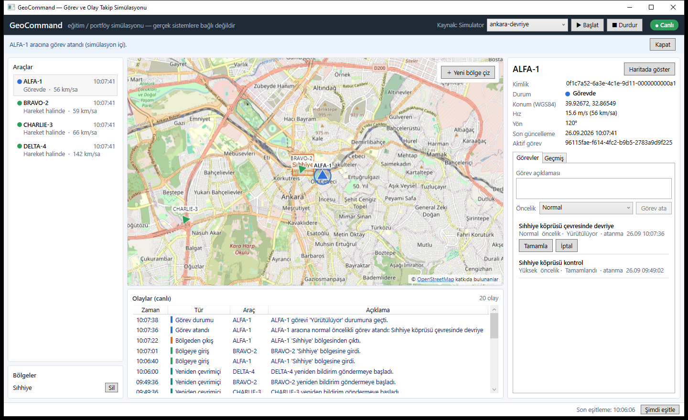
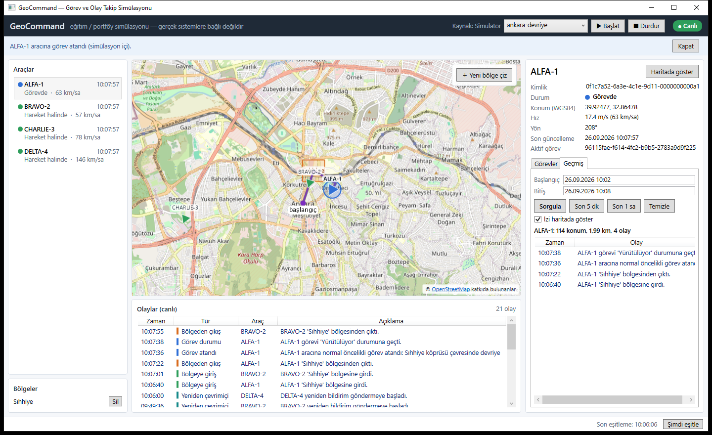
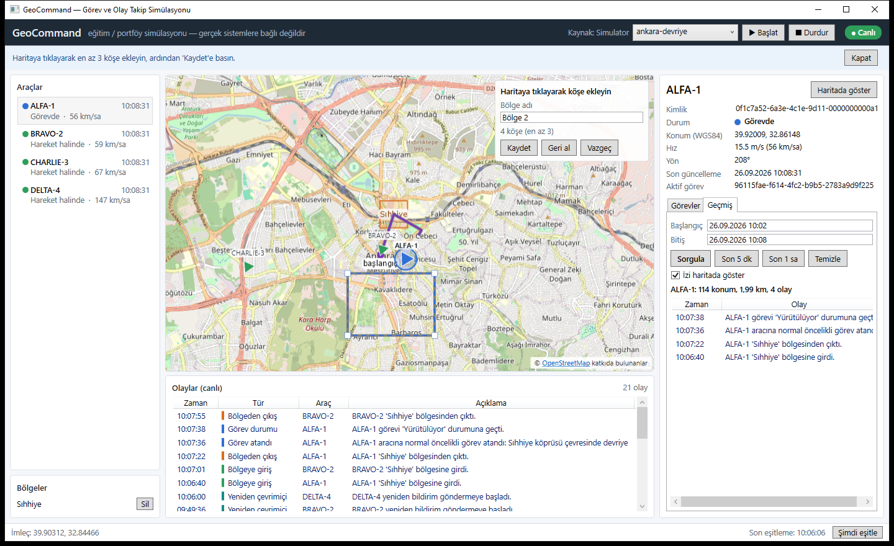
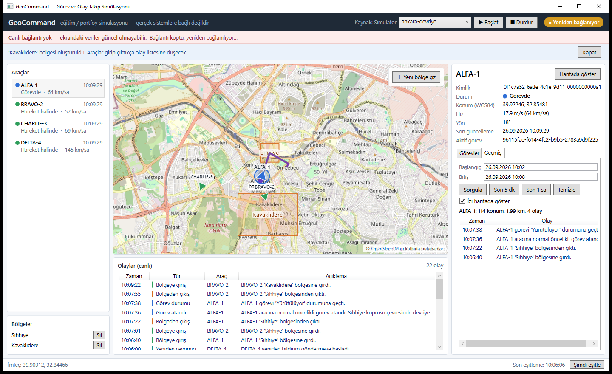
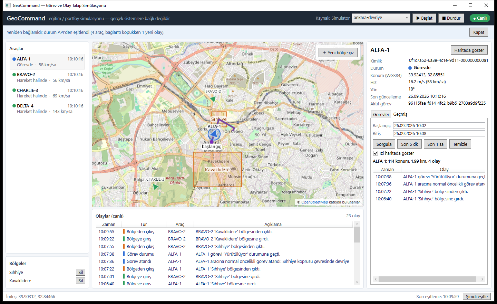
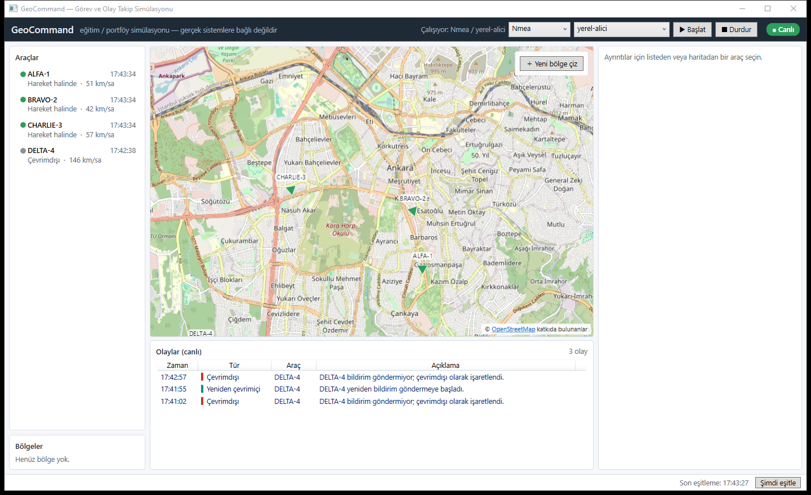
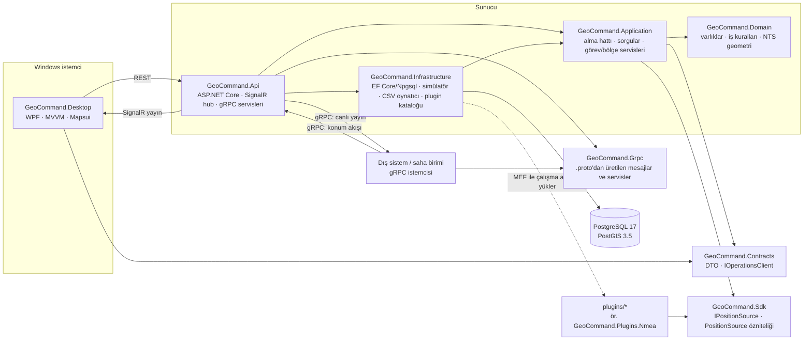
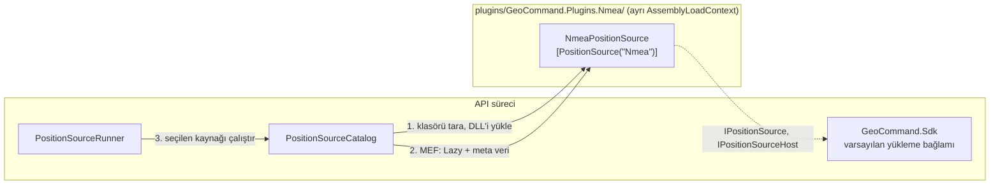

# GeoCommand

Windows üzerinde çalışan, harita tabanlı bir **görev ve olay takip simülasyonu**. Operatör simüle araçların anlık konumlarını haritada izler, operatörün çizdiği bölgelere giriş/çıkış olaylarını takip eder, araçlara görev atar ve seçili aracın belirli bir tarih aralığındaki konum geçmişini ve olaylarını sorgular.

> **Kapsam:** Bu bir eğitim/portföy simülasyonudur. Hiçbir gerçek sisteme, cihaza veya kurumsal veriye bağlanmaz. "Görev atama" yalnızca simülasyon veritabanındaki bir kaydı değiştirir.



| Konum geçmişi ve iz | Haritada bölge çizimi |
|---|---|
|  |  |
| **Bağlantı koptu** | **Yeniden bağlandı ve eşitlendi** |
|  |  |
| **Plugin kaynağı: NMEA 0183 GPS akışı** | |
|  | |

Ekran görüntüleri çalışan uygulamadan `tools/capture-window.ps1` ile alındı.

---

## İçindekiler

- [Özellikler](#özellikler)
- [Mimari](#mimari)
- [Teknoloji seçimleri](#teknoloji-seçimleri)
- [Kurulum ve çalıştırma](#kurulum-ve-çalıştırma)
- [Demo senaryosu](#demo-senaryosu-yaklaşık-3-dakika)
- [Yapılandırma](#yapılandırma)
- [Veri kaynakları ve dosya biçimleri](#veri-kaynakları-ve-dosya-biçimleri)
- [Plugin mimarisi](#plugin-mimarisi)
- [REST API ve SignalR](#rest-api-ve-signalr)
- [gRPC arayüzü](#grpc-arayüzü)
- [Testler](#testler)
- [Tasarım kararları](#tasarım-kararları)
- [Bilinen sınırlamalar](#bilinen-sınırlamalar)

## Özellikler

| # | Özellik | Nerede |
|---|---|---|
| 1 | 4 simüle araç (ALFA-1, BRAVO-2, CHARLIE-3, DELTA-4): kimlik, çağrı adı, durum, son konum, son güncelleme zamanı | `Domain/Vehicles`, migration seed |
| 2 | Ayrı arka plan hizmeti olarak simülatör; seed'e bağlı **tekrar üretilebilir** JSON senaryoları; API/istemciden başlat/durdur | `Infrastructure/DataSources/Simulation`, `Api/Hosting/PositionSourceRunner` |
| 3 | Konum bildirimleri doğrulanır, PostGIS'e kaydedilir, SignalR ile yayınlanır; harici kaynaklar için `POST /api/positions` | `Application/Ingestion` |
| 4 | WPF ekranı: araç listesi, seçili araç ayrıntıları, harita (OSM altlık), canlı olay listesi, bağlantı durumu | `Desktop` |
| 5 | Haritaya tıklayarak çokgen bölge çizme; giriş/çıkışta olay. Hesaplar WGS84 (`geometry(Polygon,4326)`) üzerinde yapılır, ekran pikseliyle değil | `Domain/Zones`, `Desktop/Views/MapView` |
| 6 | Araca görev atama: açıklama, öncelik, durum, atanma zamanı; durum geçiş kuralları; araç başına tek aktif görev | `Domain/Missions` |
| 7 | Seçili araç için tarih aralığında konum geçmişi (izi haritada gösterir, mesafe hesaplar) ve olaylar | `Application/Queries` |
| 8 | Aynı `IPositionSource` arayüzünü uygulayan kaynaklar: yerleşik **simülatör** ve **CSV kayıt dosyası** ile `plugins/` klasöründen **MEF** ile yüklenen kaynaklar (örnek: **RS-232 seri port** veya TCP üzerinden **NMEA 0183** GPS akışı). Açılışta `DataSource:Type` ile, çalışırken API'den veya istemciden seçilir | `Sdk`, `Infrastructure/DataSources/Plugins`, `plugins/` |
| 9 | Bağlantı kopunca uyarı bandı ve durum göstergesi; otomatik yeniden bağlanma; yeniden bağlanınca REST'ten eşitleme; yinelenen olay önleme | `Desktop/Services/LiveConnection`, `Desktop/ViewModels/OperationsState` |
| 10 | **gRPC** arayüzü (HTTP/2, Protobuf): sahadaki birimlerden tekil ve akışlı konum alma, dış sistemlere filtreli canlı araç/olay yayını | `protos/`, `Grpc`, `Api/GrpcServices`, `samples/GeoCommand.GrpcClient` |
| 11 | Girdi doğrulama (Türkçe ProblemDetails), yapılandırma doğrulama, Serilog ile yapılandırılmış JSON log, repoda parola yok | `Api/Hosting/ApiExceptionHandler`, `.env.example` |

Ek olarak: 15 sn bildirim göndermeyen araç **çevrimdışı** işaretlenir ve olay üretilir; bildirim yeniden gelince **yeniden çevrimiçi** olayı üretilir.

## Mimari



**Bağımlılık yönü:** `Domain` hiçbir projeye bağımlı değildir (yalnızca NetTopologySuite geometri kütüphanesi). `Application`, `Domain` ve `Contracts`'a bağımlıdır; veritabanına kendi tanımladığı `IGeoCommandDbContext` üzerinden erişir. `Infrastructure` bu arayüzü EF Core ile uygular. `Desktop` sunucu projelerinin hiçbirini görmez, yalnızca `Contracts`'ı kullanır. gRPC istemcileri de yalnızca `Grpc` sözleşme projesini (veya doğrudan `.proto` dosyasını) kullanır. Plugin'ler yalnızca küçük `Sdk` projesine bağlıdır; API'nin iç türlerini görmez, API de plugin projelerine derleme zamanında başvurmaz.

Soyutlamalar yalnızca gerçek bir ihtiyaç olduğunda eklendi:
- `IGeoCommandDbContext`: Application'ın Infrastructure'a bağımlı olmaması için.
- `IPositionSource`: üç gerçek uygulaması var (simülatör, dosya, NMEA plugin'i).
- `IOperationsClient`: SignalR hub'ının tipli arayüzü. Application yayınları bunun üzerinden yapar. Api bunu `FanOutOperationsClient` ile hem SignalR'a hem gRPC abonelerine bağlar; Application'da değişiklik gerekmedi.

Repository katmanı bilerek eklenmedi; EF Core `DbSet` zaten bu görevi görüyor.

### Bir konum bildiriminin yolu

```mermaid
sequenceDiagram
    participant S as Simülatör / CSV / plugin / HTTP / gRPC
    participant P as PositionIngestionService
    participant DB as PostGIS
    participant H as SignalR hub + gRPC yayıncı
    participant W as WPF istemci / gRPC abone

    S->>P: PositionReport (çağrı adı, enlem, boylam, hız, yön, zaman)
    P->>P: Doğrula (aralıklar, gelecek zaman, bilinen araç)
    P->>P: Araç kilidi al; bildirim son kayıttan yeni mi? (değilse Duplicate)
    P->>DB: Konum geçmişi + araç son durumu
    P->>P: GeofenceEvaluator: önceki üyelik ↔ yeni konum
    P->>DB: Üyelik satırları + ZoneEntered/ZoneExited olayları (tek işlem)
    P->>H: VehicleUpdated, EventRaised
    H-->>W: canlı güncelleme
```

## Teknoloji seçimleri

| Alan | Seçim | Gerekçe |
|---|---|---|
| Çalışma zamanı | **.NET 10 (LTS)**, SDK 10.0.401 (`global.json`) | Makinede .NET 8 kuruluydu ancak .NET 8'in desteği 10 Kasım 2026'da bitiyor. .NET 10, Kasım 2028'e kadar desteklenen güncel LTS sürümü olduğu için kuruldu. `rollForward: latestFeature` ile 10.0.x yamalarıyla derlenir. |
| Masaüstü | WPF + XAML + MVVM ([CommunityToolkit.Mvvm](https://github.com/CommunityToolkit/dotnet), MIT) | Kaynak üreticileri `INotifyPropertyChanged` ve komut tekrarını ortadan kaldırır. |
| Harita | [Mapsui 5.1](https://github.com/Mapsui/Mapsui) (MIT) + OpenStreetMap karoları | Lisansı ticari/kapalı kullanım dahil serbest; WPF kontrolü var; NTS geometrilerini doğrudan çizer. Altlık veri © OpenStreetMap katkıda bulunanlar (ODbL). Harita üzerinde atıf gösterilir ve OSM karo politikasının istediği tanımlayıcı `User-Agent` gönderilir. Bu kullanım **tanıtım amaçlıdır**; yoğun veya üretim kullanımı için kendi karo sunucunuz ya da ticari bir sağlayıcı gerekir. `Map:UseOnlineTiles=false` ile internet olmadan yalnızca vektör katmanlar çizilir. |
| Sunucu | ASP.NET Core Minimal API | Uç nokta sayısı az; controller katmanı gereksiz. |
| Canlı veri | SignalR (WebSocket), tipli hub `Hub<IOperationsClient>` | Sunucudan istemciye itme. İstemcide otomatik yeniden bağlanma var. |
| Sistemler arası | gRPC (Grpc.AspNetCore, Protobuf), HTTP/2 | Sözleşme tek `.proto` dosyasında; istemci akışı (saha birimi) ve sunucu akışı (dış sistem) gerçek akış RPC'leriyle. JSON/REST masaüstü istemcide kalır. |
| Seri haberleşme | System.IO.Ports (yalnızca NMEA plugin'inde) | RS-232/USB-seri GPS alıcıları. Paket API'ye değil plugin'e aittir; plugin'in kendi yükleme bağlamında, işletim sistemine özgü derlemesinden çözülür. |
| Veritabanı | PostgreSQL 17 + PostGIS 3.5, EF Core 10, Npgsql + NetTopologySuite | Koordinatlar `geometry(Point/Polygon, 4326)` sütunlarında tutulur ve GIST ile indekslenir. "Bölgedeki araçlar" sorgusu PostGIS'te `ST_Covers` ile çalışır. |
| Log | Serilog: konsol ve günlük dönen sıkıştırılmış JSON dosyası | Mesaj şablonları yapılandırılmış alanlar (`Çağrı`, `Bölge`, `Olay`…) olarak saklanır. |
| Test | xUnit, Testcontainers (gerçek PostGIS konteyneri), WebApplicationFactory, SignalR ve gRPC .NET istemcileri | Entegrasyon testleri bellek içi sahte veritabanı değil, gerçek PostGIS kullanır. |

## Kurulum ve çalıştırma

### Gereksinimler

| Araç | Not |
|---|---|
| Windows 10 (2004 / 19041) veya üzeri | **WPF istemci yalnızca Windows'ta çalışır.** API ve testler .NET'in çalıştığı her platformda çalışır; ancak Desktop ve Desktop.Tests projeleri Windows hedeflidir, bu yüzden `dotnet build GeoCommand.slnx` Windows dışında başarısız olur. |
| .NET SDK 10.0.x | `winget install Microsoft.DotNet.SDK.10` |
| Docker Desktop | Veritabanı ve entegrasyon testleri için |

### 1. Veritabanı

```powershell
Copy-Item .env.example .env        # sonra .env içindeki GEOCOMMAND_DB_PASSWORD değerini değiştirin
docker compose up -d               # PostGIS, localhost:5433
```

Varsayılan port **5433**'tür, çünkü makinede yerel bir PostgreSQL 5432'yi kullanıyor olabilir. `.env` git tarafından yok sayılır.

### 2. API bağlantı dizesi (repoya girmez)

```powershell
$pw = (Select-String -Path .env -Pattern '^GEOCOMMAND_DB_PASSWORD=(.*)$').Matches[0].Groups[1].Value
dotnet user-secrets set "ConnectionStrings:GeoCommand" "Host=localhost;Port=5433;Database=geocommand;Username=geocommand;Password=$pw" --project src/GeoCommand.Api
```

Alternatif olarak `ConnectionStrings__GeoCommand` ortam değişkeni de kullanılabilir. Bağlantı dizesi yoksa API, bu adımı işaret eden bir hata mesajıyla başlamaz.

### 3. API

```powershell
dotnet build GeoCommand.slnx               # plugin'leri de derler ve artifacts/plugins/ altına koyar
dotnet run --project src/GeoCommand.Api
```

- REST ve SignalR `http://localhost:5080`, gRPC `http://localhost:5081` (yalnızca HTTP/2) adresinde açılır (`Kestrel:Endpoints`). Migration'lar otomatik uygulanır (`Database:MigrateOnStartup`) ve simülatör `ankara-devriye` senaryosuyla kendiliğinden başlar.
- Sağlık kontrolü: `http://localhost:5080/health`, OpenAPI belgesi (Development): `http://localhost:5080/openapi/v1.json`

### 4. WPF istemci (ayrı terminal)

```powershell
dotnet run --project src/GeoCommand.Desktop
```

İstemci loglarını `%LOCALAPPDATA%\GeoCommand\logs\` altına yazar. API adresi `src/GeoCommand.Desktop/appsettings.json` içindeki `Api:BaseUrl` ayarından veya `GEOCOMMAND_Api__BaseUrl` ortam değişkeninden gelir.

### Kapatma / sıfırlama

```powershell
docker compose down        # veriyi korur
docker compose down -v     # veritabanı birimini de siler
```

## Demo senaryosu (yaklaşık 3 dakika)

1. **Canlı izleme.** API ve istemciyi başlatın. Dört araç Ankara merkezde hareket eder. Sol listede durumları, sağ üstte yeşil **● Canlı** göstergesi görünür.
2. **Bölge ve olay.** Harita üzerindeki **＋ Yeni bölge çiz** düğmesine basın, Sıhhiye kavşağı çevresine 4 kez tıklayın, ad verip **Kaydet**'e basın. ALFA-1 ve BRAVO-2 rotaları buradan geçer; birkaç saniye içinde olay listesine yeşil "Bölgeye giriş" ve turuncu "Bölgeden çıkış" satırları düşer.
3. **Görev atama.** ALFA-1'i listeden veya haritadan seçin. *Görevler* sekmesinde açıklama ve öncelik girip **Görev ata**'ya basın. Araç mavi **Görevde** durumuna geçer. **Başlat** ve **Tamamla** ile durum geçişlerini gösterin. İkinci görev atanmaya çalışılırsa API anlaşılır bir 409 mesajı döner.
4. **Geçmiş sorgusu.** *Geçmiş* sekmesinde **Son 5 dk**'ya basın. İz haritada mor çizgiyle, özet satırında konum sayısı, katedilen mesafe ve olaylar görünür.
5. **Bağlantı kopması.** API'nin terminalinde `Ctrl+C` ile API'yi durdurun. İstemcide kırmızı bant ve **Yeniden bağlanıyor** göstergesi çıkar. API'yi tekrar başlatın. İstemci kendiliğinden bağlanır, durumu REST'ten çeker ve mavi bantta "bağlantı kopukken N yeni olay" bilgisini gösterir. Olaylar tekrarlanmaz.
6. **Kaynak değiştirme.** Üst çubuktan `kizilay-gecis` senaryosunu seçip **Başlat**'a basın. DELTA-4 bu senaryoda olmadığı için 15 sn sonra "Çevrimdışı" olayı üretilir. **Durdur** ile tüm araçların çevrimdışına düştüğünü gösterin.
7. **Plugin kaynağı.** Ayrı bir terminalde `python tools/nmea_emitter.py --corrupt 0.05` çalıştırın. Bu betik GPS alıcısı yerine geçer: her araç için bir TCP portundan (10110-10112) `$GPRMC` cümleleri yayınlar ve cümlelerin %5'inin sağlama toplamını bilerek bozar. İstemcide kaynak tipini **Nmea** yapıp **Başlat**'a basın. Araçlar kayıttaki rotalarda hareket etmeye başlar. Bozuk cümleler API logunda `Geçersiz NMEA cümlesi` uyarısıyla elenir. Yerleşik kaynaklara aynı açılır listeden geri dönülür.
8. **gRPC.** İki terminal açın. Birinde `dotnet run --project samples/GeoCommand.GrpcClient -- watch --callsign ALFA-1 --snapshot` çalıştırın: dış sistem rolünde ALFA-1'in anlık durumunu ve ardından canlı güncellemelerini yazdırır. Diğerinde önce istemciden kaynağı **Durdur**'a basın, sonra `dotnet run --project samples/GeoCommand.GrpcClient -- stream --speed 5` çalıştırın: saha birimi rolünde kayıt dosyasındaki konumları tek bir gRPC akışından gönderir. Araçlar haritada ilerler, izleyicide yalnızca ALFA-1 ve olayları görünür. Akış bitince sunucunun özeti (kabul/ret sayıları) yazdırılır.
9. *(İsteğe bağlı)* Açılış kaynağını değiştirme: `$env:DataSource__Type="File"; dotnet run --project src/GeoCommand.Api` ile API, simülatör yerine `data/replay/ankara-kayit.csv` kaydını oynatır.

## Yapılandırma

`src/GeoCommand.Api/appsettings.json` (parola içermez):

| Anahtar | Varsayılan | Açıklama |
|---|---|---|
| `ConnectionStrings:GeoCommand` | *(yok)* | user-secrets veya ortam değişkeni ile verilir |
| `Database:MigrateOnStartup` | `true` | Açılışta migration uygula |
| `DataSource:Type` | `Simulator` | Açılışta seçili kaynak: `Simulator`, `File` veya yüklü bir plugin'in adı (`Nmea`) |
| `DataSource:AutoStart` | `true` | Kaynağı API açılışında başlat |
| `DataSource:Simulator:ScenarioDirectory` / `DefaultScenario` | `data/scenarios` / `ankara-devriye` | |
| `DataSource:File:Directory` / `DefaultFile` | `data/replay` / `ankara-kayit.csv` | |
| `DataSource:File:PlaybackSpeed` | `1.0` | 2 = iki kat hızlı |
| `DataSource:File:Loop` | `true` | Dosya bitince baştan oynat |
| `DataSource:Plugins:Directory` | `plugins` (Development: `../../artifacts/plugins`) | Plugin klasörü; göreli yol içerik köküne göre çözülür. Boş bırakılırsa plugin yüklenmez |
| `DataSource:Nmea:Scenarios:<ad>` | `yerel-alici` (3 akış, 127.0.0.1:10110-10112) | Her senaryo bir akış listesidir. TCP: `{ "Callsign", "Host", "Port" }`. Seri port: `{ "Callsign", "SerialPort": "COM5", "BaudRate"?: 4800, "Parity"?: "None", "DataBits"?: 8, "StopBits"?: "One" }`. Bir senaryoda ikisi karışık olabilir |
| `DataSource:Nmea:DefaultScenario` / `ReconnectSeconds` | `yerel-alici` / `5` | Bağlantı düşerse yeniden deneme aralığı |
| `Kestrel:Endpoints:Http` / `Grpc` | `http://localhost:5080` / `http://localhost:5081` (`Http2`) | gRPC şifresiz HTTP/2 (h2c) gerektirdiği için ayrı uç noktadadır |
| `Grpc:SubscriberBufferSize` | `1024` | gRPC abonesi başına bekleyen güncelleme sınırı; dolarsa abonelik `RESOURCE_EXHAUSTED` ile kapanır |
| `Liveness:OfflineAfterSeconds` | `15` | Bu süre bildirim yoksa araç çevrimdışı |
| `Liveness:CheckIntervalSeconds` | `5` | Kontrol aralığı |
| `Serilog:*` | konsol + `logs/geocommand-api-*.json` | |

Geçersiz yapılandırma (ör. `DataSource:Type=Foo`) API açılışında anlamlı bir mesajla yakalanır (`ValidateOnStart`). Mesajda mevcut kaynaklar ve varsa plugin yükleme hataları listelenir.

## Veri kaynakları ve dosya biçimleri

Tüm kaynaklar `IPositionSource` arayüzünü uygular ve bildirimlerini HTTP ile gelenlerle **aynı** doğrulama ve olay hattından geçirir. Senaryo, dosya veya alıcı grubu yalnızca kaynağın kendi listesinden seçilebilir; istemci keyfi bir dosya yolu ya da adres gönderemez.

### Simülatör senaryosu: `data/scenarios/*.json`

```jsonc
{
  "name": "ankara-devriye",
  "seed": 4242,          // aynı seed → aynı konum dizisi (birim testiyle doğrulanır)
  "tickSeconds": 1.0,
  "vehicles": [
    {
      "callsign": "ALFA-1",
      "speedMps": 18,
      "speedJitter": 0.15,   // her adımda hız ±%15 (seed'e bağlı)
      "dwellSeconds": 0,     // rota noktalarında bekleme (hız 0 → "Beklemede")
      "loop": true,
      "route": [[39.9208, 32.8541], [39.9300, 32.8580], [39.9265, 32.8660]]  // [enlem, boylam]
    }
  ]
}
```

Hazır senaryolar: `ankara-devriye` (4 araç döngüsel devriye) ve `kizilay-gecis` (Kızılay'ı sürekli kesen kısa rotalar; bölge olaylarını hızlı göstermek için).

### Kayıt dosyası: `data/replay/*.csv`

```text
# '#' ile başlayan satırlar yorumdur. UTF-8, ondalık ayırıcı nokta (işletim sistemi dilinden bağımsız).
offset_seconds,callsign,latitude,longitude,speed_mps,heading_deg
0.0,ALFA-1,39.9060000,32.8600000,12.93,152.9
2.0,ALFA-1,39.9057597,32.8601602,15.01,152.9
```

`offset_seconds`, oynatma başlangıcına göre saniyedir ve azalmamalıdır. Zaman damgaları oynatma anına göre yeniden hesaplanır. Hatalı satırlar satır numarasıyla raporlanır ve dosya reddedilir. Örnek dosya (`ankara-kayit.csv`, 3 araç, 5 dakika) `tools/generate_replay.py` ile sabit seed'le üretildi.

### NMEA 0183 akışı (plugin): `$xxRMC`, RS-232 veya TCP

```text
$GPRMC,123519.50,A,3955.2480,N,03251.2460,E,24.3,152.9,280926,,,A*6A
       saat UTC  │ enlem ddmm.mmmm   boylam dddmm.mmmm  hız  rota tarih     sağlama toplamı
                 durum: A = geçerli konum, V = konum yok
```

- Her alıcı (seri port veya TCP bağlantısı) tek bir araca aittir; çağrı adı yapılandırmadan gelir. Bir senaryonun akışları paralel okunur ve bir akışın kopması diğerlerini etkilemez.
- **Seri port (RS-232 / USB-seri):** Varsayılan hat ayarı NMEA 0183 standardı olan 4800 baud 8N1'dir; hız, eşlik, veri ve durma bitleri akış başına değiştirilebilir. Port açılınca tamponda kalmış yarım cümleler atılır. Port yoksa, başka bir uygulama tarafından kullanılıyorsa veya kablo çekilirse (USB dönüştürücü) `ReconnectSeconds` sonra yeniden denenir. Aynı seri port bir senaryoda iki akışa verilemez. İşletim sisteminin hiç kabul etmediği bir port adı ise yeniden denenmez: kaynak durur ve hata kaynak durumunda (`lastError`) görünür.
- **İptal:** Windows'ta seri portun bekleyen okuması iptal belirtecini dinlemez. Kaynak durdurulduğunda bağlantı akışı kapatılır, bu da bekleyen okumayı bitirir (birim testiyle doğrulanır).
- Sağlama toplamı zorunludur. Hatalı veya eksik sağlama toplamı, geçersiz alan (ör. 60'tan büyük dakika, 30 Şubat) ve 120 karakteri aşan satır reddedilir. Bağlantı başına ilk hata uyarı, sonrakiler ayrıntı (debug) düzeyinde loglanır. `V` (konum yok) cümleleri ve RMC dışı cümleler (GGA, GSV…) sessizce atlanır.
- Hız knot'tan m/s'ye çevrilir. Duran alıcı rota alanını boş gönderebilir; bu durumda son bilinen rota korunur.
- Zaman damgası alıcının UTC saatidir. Kesirli saniye `decimal` ile ayrıştırılır: `double` ile `05.06` saniye `05.0599999` oluyordu (bu hata gidiş-dönüş testiyle yakalandı).
- Satır okuyucu (`NmeaLineReader`) satır uzunluğunu sınırlar. Sonu gelmeyen bir akış belleği şişiremez; yarım kalan son cümle işlenmez.

**Seri portu donanımsız denemek:** Sanal bir null-modem port çifti gerekir. Windows'ta [com0com](https://sourceforge.net/projects/com0com/) (ör. `COM10` ↔ `COM11`), Linux'ta `socat -d -d pty,raw,echo=0 pty,raw,echo=0`. Yayıncı çiftin bir ucuna yazar, API diğer ucunu okur:

```powershell
pip install pyserial
python tools/nmea_emitter.py --serial COM11 --callsign ALFA-1
```

```jsonc
// appsettings.Development.json veya user-secrets
"DataSource": { "Nmea": { "Scenarios": { "seri-alici": [ { "Callsign": "ALFA-1", "SerialPort": "COM10" } ] } } }
```

İstemcide kaynak tipini **Nmea**, senaryoyu **seri-alici** seçip **Başlat**'a basın.

## Plugin mimarisi



- **Keşif (MEF / `System.Composition`):** Plugin sınıfı `[PositionSource("Ad", Description = "...")]` ile işaretlenir. Bu öznitelik hem `IPositionSource` dışa aktarımı hem de meta veridir. Katalog dışa aktarımları `Lazy<IPositionSource, PositionSourceMetadata>` olarak alır, bu sayede kaynak listesi ve açıklamalar plugin sınıfı **örneklenmeden** okunur. Yalnızca seçilen kaynak oluşturulur.
- **Bağımlılık enjeksiyonu:** Plugin, API'nin DI kapsayıcısını görmez. Kurucusunda `[ImportingConstructor]` ile yalnızca `IPositionSourceHost` alır. Bu arayüz üç şey verir: kendi yapılandırma bölümü (`DataSource:<Ad>`), logger fabrikası ve saat (`TimeProvider`, testlerde sahte saat için).
- **Yalıtım:** Her plugin ayrı bir `AssemblyLoadContext`'e yüklenir ve kendi bağımlılıklarını `.deps.json` üzerinden kendi klasöründen çözer. Böylece API ile farklı sürüm bir paket kullanabilir. Sözleşme derlemeleri (`GeoCommand.Sdk`, `System.Composition.*`, `Microsoft.Extensions.*`) ise bilinçli olarak API'den paylaşılır. Paylaşılmasalardı plugin'deki `IPositionSource` API'dekiyle aynı tür sayılmaz ve MEF hiçbir dışa aktarımı eşleştiremezdi. Bu durum birim testiyle doğrulanır: test projesi plugin'e doğrudan da başvurur, yine de katalogdaki tür ayrı bağlamdan gelir ve farklı bir `Type` nesnesidir.
- **Hata dayanıklılığı:** Bozuk DLL, eksik dosya veya aynı adlı ikinci kaynak yalnızca o plugin'in atlanmasına yol açar. API açılır, hata loglanır ve katalogda görünür. Ad çakışmasında yerleşik kaynak kazanır.
- **Plugin'e ait bağımlılık:** NMEA plugin'i `System.IO.Ports` paketini kullanır, API kullanmaz. Paket plugin klasörüne `runtimes/win`, `runtimes/unix` gibi işletim sistemine özgü derlemeleriyle kopyalanır. `PluginLoadContext`, `.deps.json` üzerinden çalışılan platformun derlemesini seçer. Platformdan bağımsız kopya yalnızca `PlatformNotSupportedException` fırlatan bir saplamadır. Doğru kopyanın plugin'in kendi bağlamına yüklendiği birim testiyle doğrulanır.
- **Dağıtım düzeni:** `plugins/<Ad>/<Ad>.dll` (+ `.deps.json`, varsa plugin'in kendi bağımlılıkları). Plugin projesi `EnableDynamicLoading` ile derlenir, `GeoCommand.Sdk`'ya `Private="false"` ile başvurur (sözleşme kopyalanmaz) ve derlemeden sonra çıktısını `artifacts/plugins/<Ad>/` klasörüne kopyalar.

**Yeni bir kaynak eklemek:**

```csharp
[PositionSource("Ornek", Description = "Örnek kaynak")]
public sealed class OrnekSource : IPositionSource
{
    [ImportingConstructor]
    public OrnekSource(IPositionSourceHost host) { /* host.GetSettings("Ornek")["..."] */ }

    public string SourceType => "Ornek";
    public IReadOnlyList<string> AvailableScenarios => ["varsayilan"];
    public string DefaultScenario => "varsayilan";
    public async IAsyncEnumerable<PositionReport> ReadAsync(string scenario, [EnumeratorCancellation] CancellationToken ct) { ... }
}
```

Projeyi derleyip çıktısını plugin klasörüne koymak yeterlidir. API, istemci veya veritabanı tarafında değişiklik gerekmez. Kaynak `/api/source/types` listesinde ve istemcinin açılır listesinde görünür.

## REST API ve SignalR

| Yöntem | Yol | Açıklama |
|---|---|---|
| GET | `/api/vehicles` | Tüm araçların güncel durumu (istemci yeniden bağlanınca bunu çağırır) |
| GET | `/api/vehicles/{id}` | Tek araç |
| GET | `/api/vehicles/{id}/positions?from=&to=&limit=` | Tarih aralığında konum geçmişi (en fazla 31 gün, varsayılan 5000 nokta; `truncated` bayrağı ve toplam mesafe) |
| GET | `/api/vehicles/{id}/missions` | Aracın görevleri |
| POST | `/api/vehicles/{id}/missions` | Görev ata `{ "description", "priority": "Low/Normal/High/Critical" }` → 201 |
| PUT | `/api/missions/{id}/status` | `{ "status": "InProgress/Completed/Cancelled" }` |
| GET | `/api/events?vehicleId=&from=&to=&limit=` | Olaylar (yeniden eskiye) |
| GET / POST | `/api/zones` | Bölgeleri listele / oluştur `{ "name", "vertices": [{ "latitude", "longitude" }] }` |
| DELETE | `/api/zones/{id}` | Bölgeyi sil (geçmiş olaylar korunur) |
| GET | `/api/zones/{id}/vehicles` | Son konumu bölgede olan araçlar (PostGIS `ST_Covers`) |
| POST | `/api/positions` | Harici konum bildirimi → 202 / 400 / 404 / 409 (`Duplicate`) |
| GET | `/api/source` · POST `/api/source/start` · POST `/api/source/stop` | Veri kaynağı durumu / başlat `{ "sourceType"?, "scenario"? }` (kaynak tipi verilirse çalışan kaynak durdurulup ona geçilir) / durdur |
| GET | `/api/source/types` | Seçilebilir kaynaklar: ad, açıklama, `BuiltIn`/`Plugin`, plugin sürümü, senaryolar |
| GET | `/health` | Veritabanı dahil sağlık kontrolü |

Hatalar `application/problem+json` biçiminde ve Türkçe döner:

```json
{ "title": "Girdi doğrulanamadı.", "status": 400,
  "detail": "Enlem -90 ile 90 arasında olmalı (gelen: 99). Zaman damgası gelecekte olamaz (...).",
  "errors": ["Enlem -90 ile 90 arasında olmalı (gelen: 99).", "..."] }
```

**SignalR hub:** `/hubs/operations`. Sunucudan istemciye giden mesajlar `VehicleUpdated`, `EventRaised`, `MissionChanged`, `ZoneCreated`, `ZoneDeleted` ve `SourceStatusChanged`'dir. Tanımları `Contracts/IOperationsClient.cs` dosyasındadır. Komutlar hub üzerinden değil REST üzerinden gönderilir; böylece doğrulama ve hata yanıtları tek yerde kalır.

## gRPC arayüzü

Sözleşme: [`protos/geocommand/v1/geocommand.proto`](protos/geocommand/v1/geocommand.proto). `GeoCommand.Grpc` projesi bu dosyadan mesajları, sunucu taban sınıflarını ve istemci sınıflarını üretir. API, testler ve örnek istemci aynı türleri kullanır. Başka dillerdeki istemciler doğrudan `.proto` dosyasından üretebilir. Development ortamında gRPC sunucu yansıması açıktır, bu yüzden `grpcurl -plaintext localhost:5081 list` gibi araçlar şemayı keşfedebilir.

| Servis / RPC | Tür | Açıklama |
|---|---|---|
| `Telemetry.ReportPosition` | tekil | Tek bildirim, güncel araç durumunu döner. Ret gRPC durum koduyla bildirilir: `INVALID_ARGUMENT` (geçersiz alan, eksik zaman damgası), `NOT_FOUND` (tanımsız araç), `ALREADY_EXISTS` (yinelenen/eski bildirim), `ABORTED` (eşzamanlı çakışma) |
| `Telemetry.StreamPositions` | istemci akışı | Saha biriminin sürekli telemetri bağlantısı. Tek tek reddedilen bildirimler akışı kesmez. Akış kapanınca türe göre sayaçlar ve ilk 50 retin sırası ile nedeni döner |
| `OperationsFeed.Subscribe` | sunucu akışı | Dış sistemlere canlı araç durumu ve bölge/görev/çevrimdışı olayları. Çağrı adına göre filtrelenebilir. `include_snapshot` ile önce her aracın güncel durumu gönderilir |

- **Aynı alma hattı:** gRPC bildirimleri REST ve veri kaynaklarıyla aynı `PositionIngestionService`'ten geçer ve konum geçmişinde `grpc` kaynak etiketiyle saklanır. Akıştaki her bildirim kendi DI kapsamında işlenir, bu sayede uzun bir akışta DbContext'in izlediği nesneler birikmez.
- **Anlık durum ile canlı akış arasında boşluk yok:** Abonelik veritabanı okunmadan önce açılır. Tamponda bekleyen ve anlık durumdan eski kalan araç güncellemeleri gönderilmez, böylece istemcideki durum geriye gitmez.
- **Yavaş abone:** Yayın alma hattını hiçbir zaman bekletmez. Her abonenin sınırlı bir tamponu vardır (`Grpc:SubscriberBufferSize`). Tampon dolarsa güncellemeler sessizce atlanmaz: abonelik `RESOURCE_EXHAUSTED` ile kapanır ve istemci `include_snapshot` ile yeniden abone olur. Diğer aboneler etkilenmez.
- **Kapanış:** API kapanırken açık abonelikler normal biçimde (`OK`) sonlanır, böylece kapanış istemcilerin ayrılmasını beklemez.
- **Örnek istemci:** [`samples/GeoCommand.GrpcClient`](samples/GeoCommand.GrpcClient/Program.cs). `stream` kayıt dosyasını gRPC akışıyla gönderir, `watch` canlı yayını yazdırır (bkz. [Demo senaryosu](#demo-senaryosu-yaklaşık-3-dakika), adım 8).

## Testler

```powershell
dotnet test GeoCommand.slnx     # Docker Desktop çalışıyor olmalı (entegrasyon testleri PostGIS konteyneri açar)
```

| Proje | Sayı | Kapsam |
|---|---|---|
| `GeoCommand.UnitTests` | 116 | Bölge giriş/çıkış (sınır, içbükey çokgen, ~50 m dışarıdaki nokta, çakışan bölgeler), çokgen doğrulama (kendini kesen, 180. meridyen), konum doğrulama, yinelenen bildirim, çevrimdışı/çevrimiçi, görev durum geçişleri, simülatör determinizmi, CSV ayrıştırma (tr-TR kültüründe bile), depodaki örnek dosyaların geçerliliği. **Plugin:** gerçek plugin DLL'inin MEF ile keşfi ve meta verisi, ayrı yükleme bağlamı ile paylaşılan sözleşme, bozuk/eksik plugin'in atlanması, ad çakışması, yüklenen plugin'in TCP üzerinden okuması, plugin'in `System.IO.Ports`'un platforma özgü kopyasını kendi bağlamına yüklemesi, göreli plugin klasörü ve bilinmeyen `DataSource:Type` doğrulaması. **NMEA:** RMC ayrıştırma (yarıküreler, konum yok, sağlama toplamı, 10 ayrı geçersiz alan), bağımsız Python yayıncısıyla birebir aynı çıktı, gidiş-dönüş, bayt bayt gelen ve aşırı uzun satırlar, yapılandırma hataları. **RS-232:** seri hat ayarlarının okunması ve varsayılanları (4800 8N1), geçersiz hız/eşlik/durma biti (sayısal ve birleşik enum değerleri dahil), seri ile TCP'nin aynı akışta kullanılamaması, paylaşılan seri port, meşgul/çıkarılmış portun yeniden denenmesi, hat koptuğunda yeniden bağlanıp son rotanın korunması, iptal belirtecini yok sayan bekleyen okumanın durdurulması, yeniden denenemeyen hatanın kaynağı durdurması |
| `GeoCommand.IntegrationTests` | 15 | Gerçek PostGIS + API + SignalR: bölgeyi kesen araç için tam olarak bir giriş ve bir çıkış olayı (REST ve SignalR), tekrar gönderilen bildirimin 409 alıp olay üretmemesi, görev atama ile tarih aralıklı geçmiş sorgusu uçtan uca, Türkçe ProblemDetails, dosya kaynağının yapılandırmayla seçilmesi, dizin geçişi girişiminin reddi. **Plugin:** API'nin gerçek plugin klasöründen yerleşik ve plugin kaynaklarını listelemesi, çalışma anında NMEA kaynağına geçilip sahte GPS alıcısından gelen konumların PostGIS'e yazılması, bilinmeyen kaynak tipinin 400 alması. **gRPC:** tekil bildirimin araç durumunu dönmesi ve retlerin doğru durum kodlarına eşlenmesi (Türkçe hata metni dahil), istemci akışında retlerin akışı kesmemesi ve özetin sayaç/sıra bilgisi, konumların PostGIS'e `grpc` etiketiyle yazılması, aboneliğin filtreli anlık durumla başlayıp canlı güncelleme ve bölge giriş olayını alması, iptal. **Yayıncı:** yavaş abonenin hata ile ayrılması (diğer abone etkilenmeden), SignalR yayını başarısız olsa da gRPC abonesine ulaşılması |
| `GeoCommand.Desktop.Tests` (Windows) | 18 | İstemci eşitleme kuralları: yeniden bağlanırken gelen daha yeni canlı güncellemenin korunması, olayların kimliğe göre tekilleştirilmesi, kopukken silinen bölgelerin kaldırılması, ProblemDetails'in mesaja çevrilmesi, tarih girişi biçimi |

## Tasarım kararları

**Yinelenen olay üretimini önleme (birden fazla katmanda):**
1. *Durum geçişi:* Olay yalnızca "içeride/dışarıda" durumu değiştiğinde üretilir. Üyelik bilgisi `zone_memberships` tablosunda (araç, bölge) birincil anahtarıyla tutulur.
2. *İdempotent alma:* Bir bildirimin zamanı aracın son kayıtlı zamanından yeni değilse `Duplicate` sayılır ve hiçbir şey yazılmaz. Zaman damgaları PostgreSQL'in mikrosaniye hassasiyetine indirgenir; aksi halde veritabanından okunan zaman ile tekrar gönderilen bildirim farklı görünürdü (bu hata testle yakalandı).
3. *Eşzamanlılık:* Aynı araç üzerindeki işlemler (konum, görev, çevrimdışı işaretleme) araç başına bir kilitle sıraya girer. Veritabanında ek güvence olarak kısmi tekil indeksler bulunur: araç başına tek aktif görev ve aynı bölge olayının tekrarı yasak.
4. *İstemci:* Olaylar kimliğe göre tekilleştirilir. Yeniden bağlanınca alınan anlık görüntü canlı akışla birleştirilirken eski araç güncellemesi yenisinin üzerine yazılmaz.

**Yeniden bağlanma akışı:** İstemci önce SignalR'a abone olur, ardından REST'ten araçları, son olayları, bölgeleri ve kaynak durumunu çeker. Bu sıra sayesinde aradaki boşlukta hiçbir güncelleme kaçmaz; çakışmaları `OperationsState` çözer. Sunucu tamamen kapanıp açılsa bile istemci sonsuz, artan aralıklarla (0, 2, 5, 10 sn) tekrar dener.

**Coğrafi doğruluk:** Tüm hesaplar WGS84 enlem/boylam üzerinde yapılır. Harita görüntüsü Web Mercator'dur; tıklanan nokta `SphericalMercator.ToLonLat` ile enlem/boylama çevrilip API'ye öyle gönderilir. Bölge testi NetTopologySuite `Covers` ile gerçek çokgene göre yapılır (sınır kutusuna göre değil, sınırdaki nokta "içeride" sayılır). Mesafeler haversine ile metre cinsinden hesaplanır.

**Bölge oluşturulduğunda:** O anda bölgenin içinde olan araçlar için üyelik sessizce başlatılır. "Giriş" olayı üretilmez, çünkü araç girmemiş, bölge onun etrafına çizilmiştir. Sonraki çıkış normal olarak raporlanır (entegrasyon testiyle doğrulanır).

## Bilinen sınırlamalar

- **Tek API örneği varsayılır.** Araç kilitleri süreç içidir. Birden çok API örneği için dağıtık kilit veya iyimser eşzamanlılık (`xmin`) ve SignalR backplane (ör. Redis) gerekir. Veritabanı indeksleri yinelenen olayı yine de engeller, ancak bu durumda istek hata alır.
- **Kimlik doğrulama/yetkilendirme yok.** API ve hub herkese açıktır; yalnızca yerel demo içindir.
- **Bölge ayrıntısı:** Nokta-çokgen testi enlem/boylam düzleminde yapılır. Birkaç on km'lik bölgeler için fark ihmal edilebilir; çok büyük bölgelerde kenarlar jeodezik değildir. 180. meridyeni geçen bölgeler reddedilir.
- **Simülatör:** Rotalar temsilidir, yol ağını izlemez. API yeniden başlatılınca senaryo baştan başlar ve araçlar ilk konumlarına "atlar". Bu atlama gerçek bir geçiş gibi değerlendirilip bölge olayı üretebilir.
- **Harita altlığı:** OpenStreetMap karoları internet gerektirir ve yalnızca düşük hacimli tanıtım kullanımına uygundur. Çevrimdışı modda arka plan boş kalır, araçlar, bölgeler ve iz çizilmeye devam eder.
- **Geçmiş sorgusu** tek seferde en fazla 20.000 nokta döner (`truncated` bayrağıyla bildirilir). Uzun aralıklar için sunucu tarafında seyreltme eklenmedi.
- **Konum geçmişi saklama süresi yoktur.** Tablo sürekli büyür; gerçek kullanımda bölümleme veya arşivleme gerekir.
- **Plugin'ler güvenilir koddur.** Aynı süreçte, API ile aynı yetkilerle çalışırlar. `AssemblyLoadContext` bağımlılık yalıtımı sağlar, güvenlik yalıtımı sağlamaz; plugin klasörüne yazma yetkisi yalnızca yöneticide olmalıdır. Plugin'ler çalışırken kaldırılamaz veya yeniden yüklenemez: yeni bir plugin için API yeniden başlatılır.
- **Paylaşılan sözleşme sürümü:** Plugin'ler `Microsoft.Extensions.*` ve `System.Composition` derlemelerini API'den alır. API'dekinden daha yeni bir sürüm isteyen bir plugin yüklenemez.
- **NMEA kaynağı** yalnızca RMC cümlesini kullanır: yükseklik (GGA) ve doğruluk bilgisi (HDOP) okunmaz.
- **Seri port gerçek donanımla denenmedi.** Okuma ve yeniden bağlanma mantığı sahte bir bağlantıyla, `SerialPort` açılışı ise var olmayan bir portla test edildi. Uçtan uca deneme için sanal port çifti (com0com/socat) veya bir GPS alıcısı gerekir. Yayıncının seri modu pyserial `loop://` ile doğrulandı.
- **gRPC şifresiz ve kimliksizdir** (h2c, yalnızca `localhost`). Gerçek kullanımda TLS (veya mTLS) ve yetkilendirme gerekir. Canlı yayın yalnızca araç ve olay güncellemelerini taşır; görev ve bölge değişiklikleri için REST sorgulanır.
- **WPF istemci otomatik UI testiyle kapsanmıyor.** İstemcinin durum mantığı birim testli; ekran akışları elle ve UI Automation betiğiyle doğrulandı (ekran görüntüleri).

## Proje yapısı

```text
GeoCommand/
├─ src/
│  ├─ GeoCommand.Domain/          varlıklar, iş kuralları, bölge değerlendirici
│  ├─ GeoCommand.Contracts/       DTO'lar, SignalR istemci arayüzü (sunucu + istemci ortak)
│  ├─ GeoCommand.Grpc/            protos/ altındaki .proto'dan üretilen gRPC mesajları ve servisleri
│  ├─ GeoCommand.Application/     konum alma hattı, sorgular, görev/bölge/çevrimdışı servisleri
│  ├─ GeoCommand.Sdk/             plugin sözleşmesi: IPositionSource, [PositionSource], IPositionSourceHost
│  ├─ GeoCommand.Infrastructure/  EF Core + PostGIS, migration, simülatör, CSV oynatıcı, plugin kataloğu (MEF)
│  ├─ GeoCommand.Api/             Minimal API, SignalR hub, gRPC servisleri, arka plan hizmetleri, hata yönetimi
│  └─ GeoCommand.Desktop/         WPF/MVVM istemci, Mapsui harita
├─ plugins/
│  └─ GeoCommand.Plugins.Nmea/    NMEA 0183 GPS kaynağı (RS-232 / TCP) → derleme çıktısı artifacts/plugins/
├─ protos/geocommand/v1/          gRPC sözleşmesi
├─ samples/
│  └─ GeoCommand.GrpcClient/      örnek gRPC istemcisi (konum akışı, canlı izleme)
├─ tests/
│  ├─ GeoCommand.UnitTests/
│  ├─ GeoCommand.IntegrationTests/   (Testcontainers PostGIS)
│  └─ GeoCommand.Desktop.Tests/      (Windows)
├─ data/scenarios/*.json · data/replay/*.csv
├─ tools/  generate_replay.py · nmea_emitter.py · capture-window.ps1
├─ docker-compose.yml · .env.example · global.json
```

Migration eklemek için: `dotnet tool restore` ve ardından `dotnet ef migrations add <Ad> --project src/GeoCommand.Infrastructure --startup-project src/GeoCommand.Infrastructure --output-dir Persistence/Migrations`
